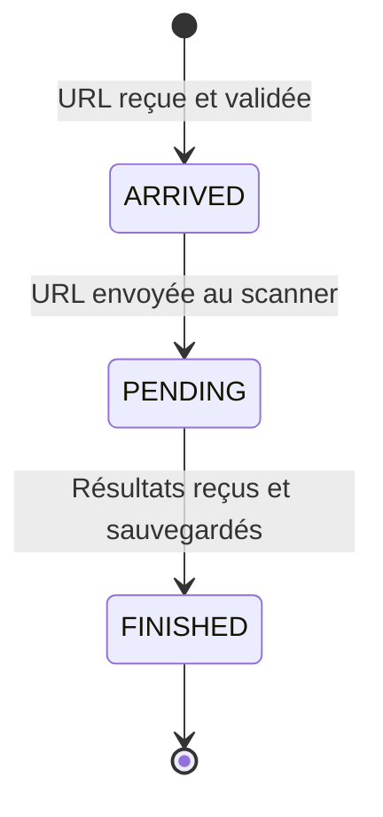
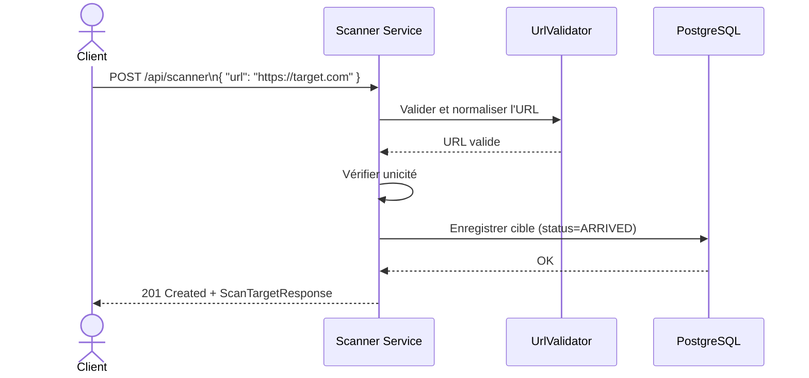
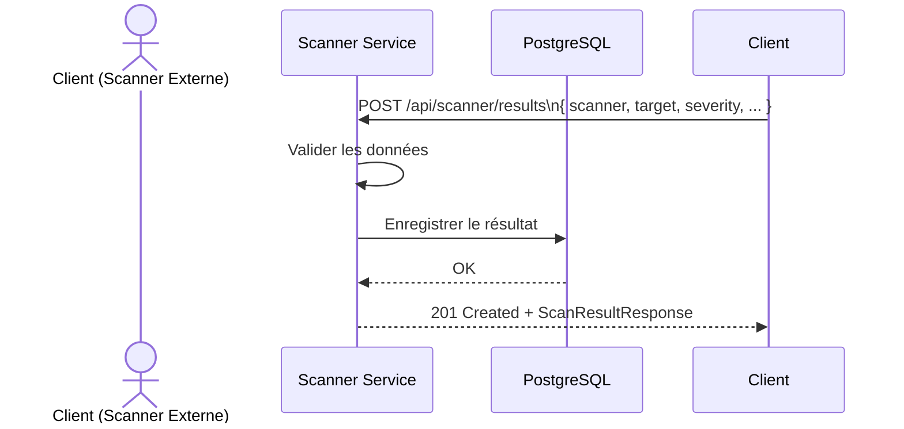
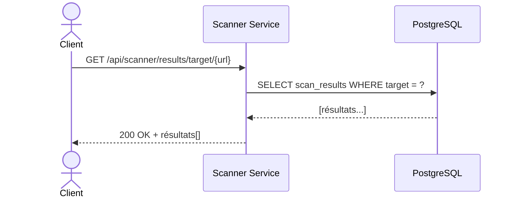
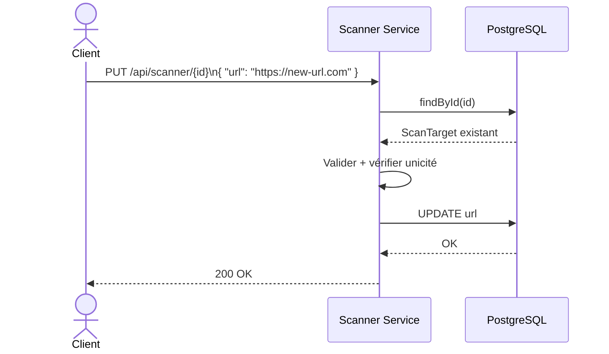
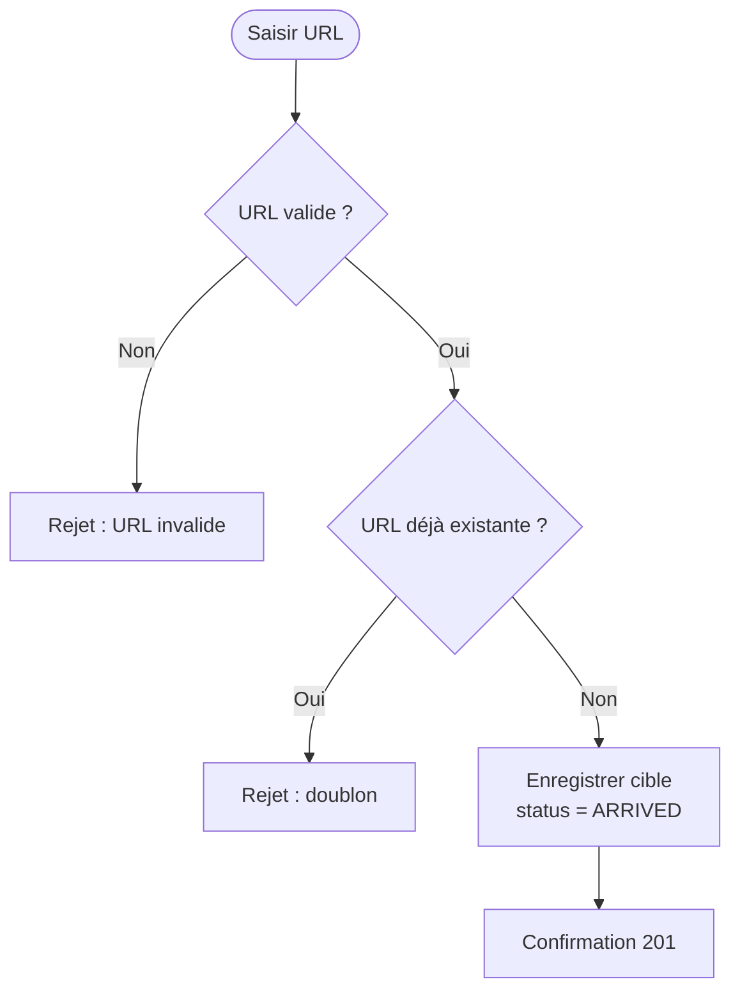
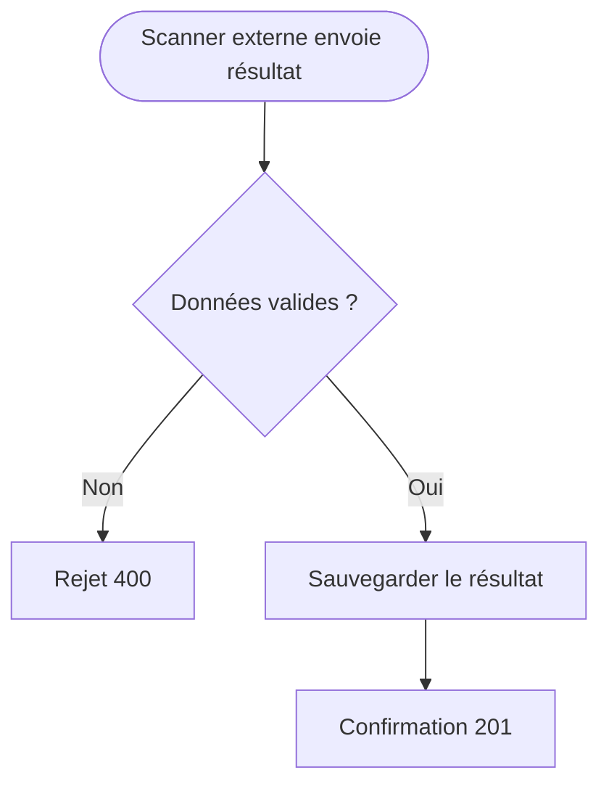
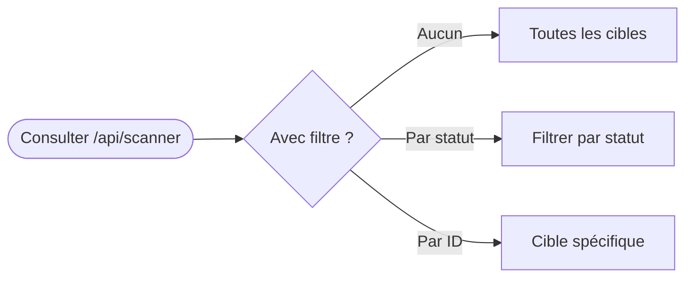
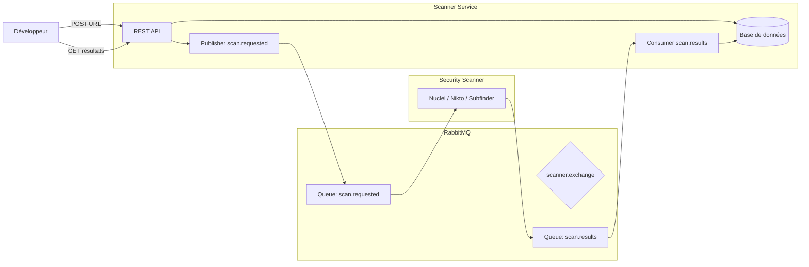

# Scanner Service - Description Métier

## 1. Vue d'ensemble

Le **Scanner Service** est le registre central des scans de sécurité. Il reçoit les URLs à scanner, les enregistre, et stocke les résultats de vulnérabilités retournés par les outils de sécurité externes (Nuclei, Nikto, Subfinder, etc.).

### Objectifs métier

- **Enregistrer des cibles** : toute URL à analyser est soumise via une API REST
- **Suivre le cycle de vie** d'un scan : `ARRIVED` → `PENDING` → `FINISHED`
- **Consulter les résultats** : filtrer par cible, scanner, sévérité, statut
- **S'intégrer avec des scanners externes** via RabbitMQ (architecture cible)

---

## 2. Cycle de Vie d'un Scan

| Statut | Description |
|---|---|
| `ARRIVED` | URL reçue, validée, en attente d'envoi au scanner |
| `PENDING` | Envoyée au scanner, en cours de traitement |
| `FINISHED` | Résultats reçus et sauvegardés |

---

## 3. Diagrammes de Séquence

### 3.1 Création d'une Cible de Scan

### 3.2 Soumission d'un Résultat de Scan

### 3.3 Consultation des Résultats

### 3.4 Mise à jour d'une Cible

---

## 4. Diagrammes d'Activité

### 4.1 Création d'une Cible

### 4.2 Soumission d'un Résultat

### 4.3 Consultation des Cibles

---

## 5. Architecture Cible (avec intégration RabbitMQ)

### Flux des échanges

| Étape | Quoi | Comment |
|---|---|---|
| 1 | Soumettre URL | `POST /api/scanner` |
| 2 | Publier scan.requested | RabbitMQ → Security Scanner |
| 3 | Exécuter les outils | Nuclei, Nikto, Subfinder |
| 4 | Publier scan.results | Security Scanner → RabbitMQ |
| 5 | Sauvegarder résultats | Scanner Service → DB |
| 6 | Consulter résultats | `GET /api/scanner/results/...` |

---

## 6. Règles de Gestion

| Règle | Description |
|---|---|
| RG-01 | Une URL doit être valide (format HTTP/HTTPS) avant d'être enregistrée |
| RG-02 | Une URL ne peut être enregistrée qu'une seule fois (unicité) |
| RG-03 | Un résultat de scan doit avoir un scanner, une cible, une sévérité et un titre |
| RG-04 | Le score CVSS doit être compris entre 0.0 et 10.0 |
| RG-05 | La sévérité doit être parmi : CRITICAL, HIGH, MEDIUM, LOW, INFO |
| RG-06 | Le statut est insensible à la casse (ARRIVED, PENDING, FINISHED) |
