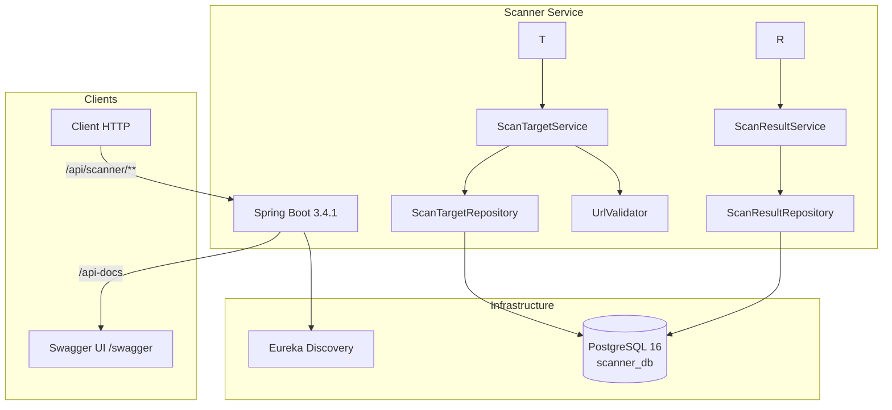
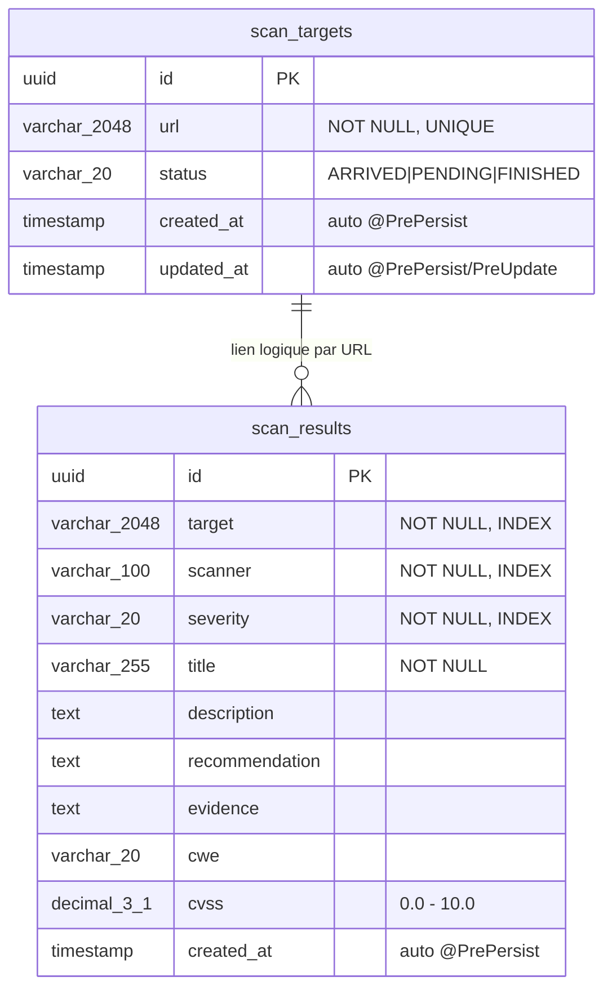

# Scanner Service - Description Technique

## 1. Stack Technique

| Composant | Technologie |
|---|---|
| Framework | Spring Boot 3.4.1 |
| Java | 21 |
| Base de données | PostgreSQL 16 |
| ORM | Spring Data JPA (Hibernate) |
| Découverte | Eureka Client (Spring Cloud 2024.0.0) |
| Documentation API | SpringDoc OpenAPI 2.8.9 |
| Validation | Spring Boot Starter Validation |
| Monitoring | Spring Boot Actuator |
| Packaging | JAR (via Maven) |

---

## 2. Structure du Projet

```
src/main/java/mohamed/boufous/scannerservice/
├── ScannerServiceApplication.java        # @SpringBootApplication
├── config/
│   ├── DataInitializer.java              # Seed data (dev)
│   └── WebConfig.java                    # Configuration CORS
├── constants/
│   ├── ApiConstants.java                 # Chemins d'API
│   └── MessageConstants.java             # Messages d'erreur/validation
├── controller/
│   ├── ScanResultController.java         # REST /api/scanner/results
│   └── ScanTargetController.java         # REST /api/scanner
├── dto/
│   ├── request/
│   │   ├── ScanResultCreateRequest.java  # Record validation
│   │   ├── ScanTargetCreateRequest.java
│   │   └── ScanTargetUpdateRequest.java
│   └── response/
│       ├── ErrorResponse.java            # ErrorResponse + FieldError
│       ├── ScanResultResponse.java
│       └── ScanTargetResponse.java
├── entity/
│   ├── ScanResult.java                   # JPA @Entity -> scan_results
│   └── ScanTarget.java                   # JPA @Entity -> scan_targets
├── enums/
│   └── ScanStatus.java                   # ARRIVED, PENDING, FINISHED
├── exception/
│   ├── BusinessException.java            # Exception métier avec code HTTP
│   ├── GlobalExceptionHandler.java       # @RestControllerAdvice global
│   └── ResourceNotFoundException.java    # 404
├── mapper/
│   ├── ScanResultMapper.java             # Entity -> DTO (statique)
│   └── ScanTargetMapper.java
├── repository/
│   ├── ScanResultRepository.java         # JpaRepository<ScanResult, UUID>
│   └── ScanTargetRepository.java         # JpaRepository<ScanTarget, UUID>
├── service/
│   ├── ScanResultService.java            # Interface
│   ├── ScanTargetService.java            # Interface
│   └── impl/
│       ├── ScanResultServiceImpl.java    # @Service @Transactional
│       └── ScanTargetServiceImpl.java
└── util/
    └── UrlValidator.java                 # Validation + normalisation URL

src/main/resources/
└── application.properties

src/test/java/mohamed/boufous/scannerservice/
└── ScannerServiceApplicationTests.java
```

---

## 3. Diagramme de Classes

```mermaid
classDiagram
    class ScanTarget {
        <<Entity>>
        - UUID id
        - String url [UNIQUE]
        - ScanStatus status
        - LocalDateTime createdAt
        - LocalDateTime updatedAt
        + @PrePersist onCreate()
        + @PreUpdate onUpdate()
    }

    class ScanResult {
        <<Entity>>
        - UUID id
        - String scanner
        - String target
        - String severity
        - String title
        - String description
        - String recommendation
        - String evidence
        - String cwe
        - Double cvss
        - LocalDateTime createdAt
        + @PrePersist onCreate()
    }

    class ScanStatus {
        <<Enum>>
        ARRIVED
        PENDING
        FINISHED
        + fromString(String) ScanStatus
    }

    class ScanTargetRepository {
        <<Interface>>
        + findByStatus(ScanStatus) List
        + existsByUrl(String) boolean
        + existsByUrlAndIdNot(String, UUID) boolean
    }

    class ScanResultRepository {
        <<Interface>>
        + findByTarget(String) List
        + findByScanner(String) List
        + findBySeverity(String) List
    }

    class UrlValidator {
        <<Utility>>
        + isValid(String) boolean
        + normalize(String) String
    }

    ScanTarget --> ScanStatus
    ScanTargetRepository --> ScanTarget
    ScanResultRepository --> ScanResult
    ScanTargetServiceImpl --> ScanTargetRepository
    ScanTargetServiceImpl --> UrlValidator
    ScanResultServiceImpl --> ScanResultRepository
    ScanTargetController --> ScanTargetService
    ScanResultController --> ScanResultService
    ScanTargetServiceImpl ..|> ScanTargetService
    ScanResultServiceImpl ..|> ScanResultService
```



---

## 4. Diagramme d'Architecture



---

## 5. Schéma de la Base de Données

### 5.1 Diagramme Relationnel



### 5.2 Dictionnaire de Données

#### Table : `scan_targets`

| Champ | Type | Contrainte | Description |
|---|---|---|---|
| `id` | UUID | PK, AUTO | Identifiant unique |
| `url` | VARCHAR(2048) | NOT NULL, UNIQUE | URL normalisée de la cible |
| `status` | VARCHAR(20) | NOT NULL | État : `ARRIVED` / `PENDING` / `FINISHED` |
| `created_at` | TIMESTAMP | NOT NULL | Date de création (auto via `@PrePersist`) |
| `updated_at` | TIMESTAMP | | Date de modification (auto) |

#### Table : `scan_results`

| Champ | Type | Contrainte | Description |
|---|---|---|---|
| `id` | UUID | PK, AUTO | Identifiant unique |
| `target` | VARCHAR(2048) | NOT NULL, INDEX | URL cible (lien logique vers `scan_targets.url`) |
| `scanner` | VARCHAR(100) | NOT NULL, INDEX | Outil de scan (nuclei, nikto, subfinder...) |
| `severity` | VARCHAR(20) | NOT NULL, INDEX | `CRITICAL` / `HIGH` / `MEDIUM` / `LOW` / `INFO` |
| `title` | VARCHAR(255) | NOT NULL | Titre de la vulnérabilité |
| `description` | TEXT | | Description détaillée |
| `recommendation` | TEXT | | Recommandation de correction |
| `evidence` | TEXT | | Preuve technique |
| `cwe` | VARCHAR(20) | | Identifiant CWE (ex: CWE-79) |
| `cvss` | DECIMAL(3,1) | | Score CVSS (0.0 - 10.0) |
| `created_at` | TIMESTAMP | NOT NULL | Date de création (auto via `@PrePersist`) |

> **Note :** Relation entre `scan_targets` et `scan_results` est un lien **logique par URL**, pas une FK physique. Les résultats peuvent provenir de services externes sans contrainte d'intégrité référentielle stricte.

---

## 6. API Endpoints

### 6.1 Scan Targets (`/api/scanner`)

| Méthode | Path | Description | Request | Response |
|---|---|---|---|---|
| `GET` | `/api/scanner` | Lister toutes les cibles | - | `200` + `List<ScanTargetResponse>` |
| `GET` | `/api/scanner/{id}` | Cible par ID | - | `200` \| `404` |
| `POST` | `/api/scanner` | Créer une cible | `ScanTargetCreateRequest` | `201` |
| `PUT` | `/api/scanner/{id}` | Modifier une cible | `ScanTargetUpdateRequest` | `200` |
| `DELETE` | `/api/scanner/{id}` | Supprimer une cible | - | `204` |
| `GET` | `/api/scanner/status/{status}` | Filtrer par statut | - | `200` |

### 6.2 Scan Results (`/api/scanner/results`)

| Méthode | Path | Description | Request | Response |
|---|---|---|---|---|
| `GET` | `/api/scanner/results` | Lister tous les résultats | - | `200` |
| `GET` | `/api/scanner/results/{id}` | Résultat par ID | - | `200` \| `404` |
| `POST` | `/api/scanner/results` | Créer un résultat | `ScanResultCreateRequest` | `201` |
| `GET` | `/api/scanner/results/target/{target}` | Filtrer par cible | - | `200` |
| `GET` | `/api/scanner/results/scanner/{scanner}` | Filtrer par scanner | - | `200` |
| `GET` | `/api/scanner/results/severity/{severity}` | Filtrer par sévérité | - | `200` |

---

## 7. Gestion des Erreurs

Le `GlobalExceptionHandler` (annoté `@RestControllerAdvice`) intercepte et formate toutes les erreurs :

| Exception | HTTP Status | Description |
|---|---|---|
| `MethodArgumentNotValidException` | `400 Bad Request` | Échec de validation `@Valid` avec détails des champs |
| `IllegalArgumentException` | `400 Bad Request` | Argument invalide (enum, format) |
| `HttpMessageNotReadableException` | `400 Bad Request` | Corps de requête mal formé |
| `ResourceNotFoundException` | `404 Not Found` | Ressource introuvable par ID |
| `BusinessException` | Status code métier | Erreur métier (doublon, URL invalide, etc.) |
| `DataIntegrityViolationException` | `409 Conflict` | Violation de contrainte DB (unicité) |
| `Exception` (générique) | `500 Internal Server Error` | Erreur inattendue |

### Format de réponse

```json
{
  "status": 400,
  "error": "Bad Request",
  "message": "Request validation failed",
  "timestamp": "2026-07-19T10:30:00",
  "fieldErrors": [
    { "field": "url", "message": "L'URL ne peut pas être vide" }
  ]
}
```

---

## 8. Configuration

### application.properties

```properties
# Server
server.port=${SERVER_PORT:8080}

# PostgreSQL
spring.datasource.url=${SPRING_DATASOURCE_URL:jdbc:postgresql://scanner-db:5432/scanner_db}
spring.datasource.username=${SPRING_DATASOURCE_USERNAME:scanner}
spring.datasource.password=${SPRING_DATASOURCE_PASSWORD}
spring.datasource.driver-class-name=org.postgresql.Driver

# Swagger
springdoc.swagger-ui.path=/swagger
springdoc.api-docs.path=/api-docs

# JPA
spring.jpa.hibernate.ddl-auto=${JPA_DDL_AUTO:update}
spring.jpa.open-in-view=false
spring.jpa.properties.hibernate.dialect=org.hibernate.dialect.PostgreSQLDialect

# Eureka
eureka.client.enabled=${EUREKA_CLIENT_ENABLED:true}
eureka.client.service-url.defaultZone=http://discovery-service:8761/eureka/
eureka.instance.prefer-ip-address=true
```

### Dockerfile

```dockerfile
FROM eclipse-temurin:25-jre
VOLUME /tmp
COPY target/*.jar app.jar
ENTRYPOINT ["java", "-jar", "app.jar"]
```
